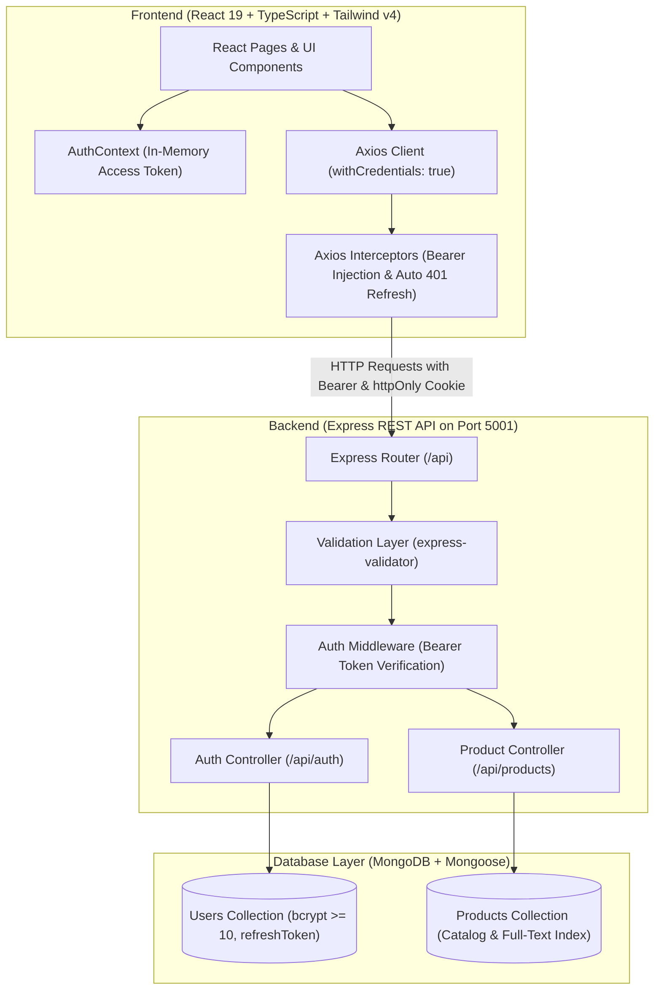
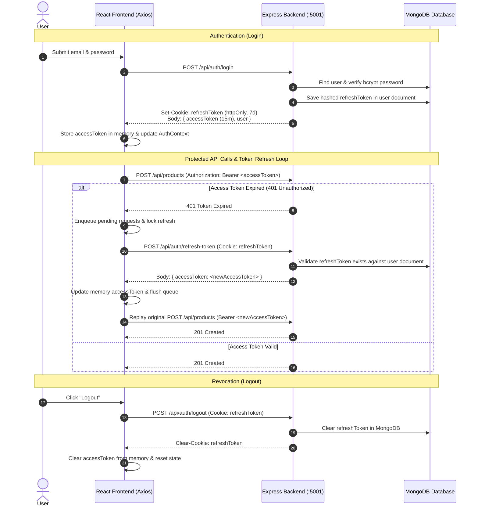

# Context Cart — Modern Full-Stack E-Commerce Platform

[](https://react.dev/)
[](https://www.typescriptlang.org/)
[](https://tailwindcss.com/)
[](https://nodejs.org/)
[](https://expressjs.com/)
[](https://www.mongodb.com/)
[](https://jwt.io/)

Context Cart is a production-ready, full-stack e-commerce web application featuring a modern React 19 frontend and an Express & MongoDB REST API. It includes secure JWT access and refresh token authentication, server-persisted session revocation, field-level validation with `express-validator`, protected product catalog management (Add, Edit, Delete), and a monorepo workspace.

---

## Table of Contents

- [System Architecture](#system-architecture)
- [Tech Stack](#tech-stack)
- [Monorepo Structure](#monorepo-structure)
- [Getting Started & Local Setup](#getting-started--local-setup)
  - [Prerequisites](#prerequisites)
  - [Installation](#1-installation)
  - [Environment Configuration](#2-environment-configuration)
  - [Database Seeding](#3-database-seeding)
  - [Running the Application](#4-running-the-application)
- [API Documentation Reference](#api-documentation-reference)
  - [Authentication Endpoints](#authentication-endpoints)
  - [Product Endpoints](#product-endpoints)
- [Validation & Error Handling Standards](#validation--error-handling-standards)
- [Authentication & Token Security Model](#authentication--token-security-model)
- [Deployment Guide](#deployment-guide)
  - [1. Database (MongoDB Atlas)](#1-database-mongodb-atlas)
  - [2. Backend (Render / Railway)](#2-backend-render--railway)
  - [3. Frontend (Vercel)](#3-frontend-vercel)
- [Assignment Traceability Checklist](#assignment-traceability-checklist)

---

## System Architecture



### JWT Token Lifecycle & Silent Refresh Flow



---

## Tech Stack

| Layer | Technologies |
| :--- | :--- |
| **Frontend Framework** | React 19, TypeScript, Vite 8 |
| **Styling & UI** | Tailwind CSS v4, PostCSS, Lucide React Icons |
| **Routing** | React Router DOM v7 |
| **HTTP Client** | Axios (configured with `withCredentials: true`, Bearer interceptor, and 401 refresh queue) |
| **Form Management** | React Hook Form & Zod (client validation) |
| **Backend Runtime** | Node.js (ES Modules), Express.js |
| **Database & ODM** | MongoDB Atlas / Local MongoDB, Mongoose 8 |
| **Server Validation** | `express-validator` (sanitization, schema checks, MongoDB ObjectId validation) |
| **Security & Auth** | JSON Web Tokens (`jsonwebtoken`), `bcryptjs` ($\ge 10$ salt rounds), `cookie-parser`, `cors` |
| **Monorepo Tools** | `concurrently`, npm workspaces |

---

## Monorepo Structure

```text
context-cart/
├── server/                     # Backend Node.js / Express REST API
│   ├── src/
│   │   ├── config/             # MongoDB connection (db.js)
│   │   ├── controllers/        # authController.js, productController.js
│   │   ├── middleware/         # authenticate.js, validate.js, errorHandler.js
│   │   ├── models/             # User.js (bcrypt + refresh token), Product.js
│   │   ├── routes/             # authRoutes.js, productRoutes.js
│   │   ├── scripts/            # seed.js (MongoDB product seeder)
│   │   ├── utils/              # token.js (JWT signing, cookie options)
│   │   ├── validators/         # authValidator.js, productValidator.js
│   │   └── server.js           # Express app setup and listener
│   ├── .env.example
│   └── package.json
├── src/                        # Frontend React 19 Application
│   ├── components/             # Reusable UI components
│   │   ├── common/             # Hero, SearchBar, Breadcrumbs, Button, Badge
│   │   ├── layout/             # Navbar, Footer
│   │   ├── product/            # ProductCard, ProductGrid, ProductModal, QuantitySelector
│   │   └── category/           # CategoryCard
│   ├── context/                # AuthContext (real JWT), CartContext, ThemeContext
│   ├── pages/                  # Home, Products, ProductDetails, Categories, Login, Register, Cart
│   ├── routes/                 # AppRoutes.tsx
│   ├── services/               # api.ts (Axios + auto-refresh), productService.ts
│   ├── types/                  # product.ts, auth.ts, cart.ts
│   ├── App.tsx
│   └── main.tsx
├── .env.example                # Root environment example for frontend
├── package.json                # Monorepo root with concurrent scripts
└── README.md                   # Complete documentation & API guide
```

---

## Getting Started & Local Setup

### Prerequisites
- **Node.js**: v18.0.0 or higher (`node -v`)
- **MongoDB**: Local MongoDB instance (`mongodb://localhost:27017`) or free [MongoDB Atlas](https://www.mongodb.com/atlas) connection URI.

---

### 1. Installation

Install dependencies for both frontend and backend in one command from the project root:

```bash
git clone https://github.com/theravirai/context-cart.git
cd context-cart
npm run install:all
```

---

### 2. Environment Configuration

#### Backend Configuration:
Create a `.env` file in the `server/` directory:

```bash
cp server/.env.example server/.env
```

Edit `server/.env` with your settings:
```env
PORT=5001
NODE_ENV=development
CLIENT_URL=http://localhost:5173
MONGO_URI=mongodb://localhost:27017/context-cart
ACCESS_TOKEN_SECRET=replace_with_a_secure_random_32_byte_secret
REFRESH_TOKEN_SECRET=replace_with_another_secure_random_32_byte_secret
ACCESS_TOKEN_EXPIRY=15m
REFRESH_TOKEN_EXPIRY=7d
```

> **Note on Port 5001:** Port 5001 is used by default to prevent port conflicts with macOS AirPlay Receiver / ControlCenter running on port 5000.

#### Frontend Configuration:
Create a `.env` file in the root directory:

```bash
cp .env.example .env
```

Content of `.env`:
```env
VITE_API_URL=http://localhost:5001/api
```

---

### 3. Database Seeding

Populate MongoDB with 8 sample products across multiple categories:

```bash
npm run seed
```

---

### 4. Running the Application

Launch both the Express backend and the Vite frontend concurrently with a single command:

```bash
npm run dev
# or
npm run dev:all
```

- **Frontend Application:** `http://localhost:5173`
- **Backend REST API:** `http://localhost:5001/api`
- **Health Check:** `http://localhost:5001/health`

#### Individual Workspace Commands:
| Command | Action |
| :--- | :--- |
| `npm run dev:client` | Runs frontend Vite server on `http://localhost:5173` |
| `npm run dev:server` | Runs backend Express server on `http://localhost:5001` with nodemon |
| `npm run seed` | Seeds MongoDB catalog with sample products |
| `npm run build` | Compiles TypeScript and creates optimized production frontend bundle |
| `npm run start:server` | Runs backend in production mode without nodemon |

---

## API Documentation Reference

Base URL: `http://localhost:5001/api` (or your deployed API domain)

### Authentication Endpoints

| Method | Endpoint | Access | Headers / Cookies | Request Body Schema | Success Response | Error Codes |
| :--- | :--- | :--- | :--- | :--- | :--- | :--- |
| `POST` | `/auth/register` | Public | None | `{ "name": "string", "email": "valid email", "password": ">=6 chars", "confirmPassword": "match" }` | `201 Created`<br/>`{ "message": "User registered successfully", "user": { "id", "name", "email" } }` | `400` (Validation error)<br/>`409` (Email conflict) |
| `POST` | `/auth/login` | Public | None | `{ "email": "valid email", "password": "string" }` | `200 OK`<br/>**Set-Cookie:** `refreshToken` (httpOnly, 7d)<br/>`{ "accessToken": "jwt", "user": { "id", "name", "email" } }` | `400` (Invalid fields)<br/>`401` (Invalid email or password) |
| `POST` | `/auth/refresh-token` | Public | **Cookie:** `refreshToken=<token>` | None | `200 OK`<br/>`{ "accessToken": "new_jwt" }` | `401` (No token provided)<br/>`403` (Token invalid / revoked) |
| `POST` | `/auth/logout` | Public | **Cookie:** `refreshToken=<token>` | None | `200 OK`<br/>**Clear-Cookie:** `refreshToken`<br/>`{ "message": "Logged out successfully" }` | `200` (Always clears cookie) |
| `GET` | `/auth/me` | Authenticated | `Authorization: Bearer <accessToken>` | None | `200 OK`<br/>`{ "user": { "id", "name", "email", "createdAt" } }` | `401` (Token missing / invalid) |

---

### Product Endpoints

| Method | Endpoint | Access | Headers / Params | Request Body Schema | Success Response | Error Codes |
| :--- | :--- | :--- | :--- | :--- | :--- | :--- |
| `GET` | `/products` | Public | Query: `?category=...&search=...&limit=20&skip=0&sortBy=createdAt&order=desc` | None | `200 OK`<br/>`{ "products": [...], "total": 8, "skip": 0, "limit": 20 }` | `500` (Server error) |
| `GET` | `/products/categories` | Public | None | None | `200 OK`<br/>`[ { "slug": "electronics", "name": "Electronics", "url": "/categories/electronics" } ]` | `500` (Server error) |
| `GET` | `/products/:id` | Public | Param: `:id` (24-char hex MongoDB ObjectId) | None | `200 OK`<br/>`{ "id", "title", "price", "description", "category", "stock", "images", ... }` | `400` (Invalid ObjectId)<br/>`404` (Product not found) |
| `POST` | `/products` | Authenticated | `Authorization: Bearer <accessToken>` | `{ "title": "string*", "description": "string*", "price": number*, "category": "string*", "stock": int*, "brand": "string", "discountPercentage": number, "thumbnail": "url", "images": ["url"] }` | `201 Created`<br/>`{ "message": "Product created successfully", "product": { ... } }` | `400` (Validation errors)<br/>`401` (Unauthorized) |
| `PUT` | `/products/:id` | Authenticated | `Authorization: Bearer <accessToken>`<br/>Param: `:id` | Any partial product fields to update (title, price, stock, etc.) | `200 OK`<br/>`{ "message": "Product updated successfully", "product": { ... } }` | `400` (Invalid data / ObjectId)<br/>`401` (Unauthorized)<br/>`404` (Product not found) |
| `DELETE` | `/products/:id` | Authenticated | `Authorization: Bearer <accessToken>`<br/>Param: `:id` | None | `200 OK`<br/>`{ "message": "Product deleted successfully" }` | `400` (Invalid ObjectId)<br/>`401` (Unauthorized)<br/>`404` (Product not found) |

*\* Denotes required fields*

---

## Validation & Error Handling Standards

All incoming requests are validated using `express-validator` middleware before hitting controller actions.

### Standardized 400 Field-Level Error Format
When validation fails, the API responds with `400 Bad Request` in a standardized format:

```json
{
  "errors": [
    { "field": "email", "message": "Please enter a valid email address" },
    { "field": "password", "message": "Password must be at least 6 characters long" }
  ]
}
```

The frontend maps these errors dynamically to render red highlights and specific helper text directly beneath the offending input fields in forms.

### Route Parameter ObjectId Validation
Every route containing `:id` runs the `validateProductId` check (`isMongoId()`). If a malformed ID is supplied (e.g. `/api/products/123`), the request is rejected immediately with `400 Bad Request` without executing unnecessary database queries:

```json
{
  "errors": [
    { "field": "id", "message": "Invalid product ID format" }
  ]
}
```

---

## Authentication & Token Security Model

1. **Password Hashing:** Passwords are automatically hashed in a Mongoose `pre('save')` hook using `bcryptjs` with **10 salt rounds**. Plaintext passwords are never stored or returned.
2. **Access Token:**
   - Expiration: **15 minutes**.
   - Transmission: `Authorization: Bearer <accessToken>` HTTP header.
   - Storage: Held **strictly in-memory** inside `AuthContext` state. Never stored in `localStorage` or `sessionStorage` to eliminate XSS vulnerability.
3. **Refresh Token:**
   - Expiration: **7 days**.
   - Transmission: `httpOnly`, `SameSite: Lax` (or `None` with `Secure: true` in production) cookie.
   - Server-Side Revocation: Stored in MongoDB on the `User` document.
4. **Silent Refresh Interceptor Queue:**
   - When any API request receives a `401 Unauthorized`, the Axios response interceptor holds concurrent requests in a `failedQueue` and calls `/api/auth/refresh-token`.
   - Upon receiving a fresh access token, it updates in-memory state and replays all queued requests seamlessly.
5. **Server-Side Revocation on Logout:**
   - Calling `/api/auth/logout` clears `refreshToken` on the user's MongoDB record and invalidates the cookie, ensuring revoked tokens cannot be reused.

---

## Deployment Guide

### 1. Database (MongoDB Atlas)
1. Create a free M0 cluster on [MongoDB Atlas](https://www.mongodb.com/atlas).
2. Under **Database Access**, create a user with read/write privileges.
3. Under **Network Access**, add `0.0.0.0/0` (allow all IP access) to enable cloud hosting providers (e.g., Render/Railway) to connect.
4. Copy your connection string: `mongodb+srv://<user>:<password>@cluster.mongodb.net/context-cart?retryWrites=true&w=majority`.

---

### 2. Backend (Render / Railway)
1. Create a new Web Service pointing to your GitHub repository.
2. **Root Directory:** `server`
3. **Build Command:** `npm install`
4. **Start Command:** `npm start`
5. **Environment Variables:**
   ```env
   NODE_ENV=production
   PORT=5001
   CLIENT_URL=https://your-frontend.vercel.app
   MONGO_URI=mongodb+srv://<user>:<password>@cluster.mongodb.net/context-cart?retryWrites=true&w=majority
   ACCESS_TOKEN_SECRET=generate_strong_64_char_secret_key
   REFRESH_TOKEN_SECRET=generate_strong_64_char_secret_key
   ACCESS_TOKEN_EXPIRY=15m
   REFRESH_TOKEN_EXPIRY=7d
   ```

---

### 3. Frontend (Vercel)
1. Import your GitHub repository into [Vercel](https://vercel.com).
2. **Framework Preset:** Vite
3. **Root Directory:** `./`
4. **Build Command:** `npm run build`
5. **Output Directory:** `dist`
6. **Environment Variables:**
   ```env
   VITE_API_URL=https://your-backend.onrender.com/api
   ```
7. Configure `vercel.json` for client-side routing:
   ```json
   {
     "rewrites": [{ "source": "/(.*)", "destination": "/index.html" }]
   }
   ```

---

## Assignment Traceability Checklist

| Sheryians Assignment Requirement | Covered In | Status |
| :--- | :--- | :---: |
| **Task 1: Authentication System** | | |
| Password hashing with bcrypt ($\ge 10$ rounds) | `server/src/models/User.js` | ✅ Complete |
| Register with duplicate 409 check, no token returned | `server/src/controllers/authController.js` | ✅ Complete |
| Login with short-lived access token & 7d httpOnly refresh cookie | `server/src/utils/token.js` | ✅ Complete |
| Refresh token endpoint with DB verification | `server/src/controllers/authController.js` | ✅ Complete |
| Server-side token revocation on logout | `server/src/controllers/authController.js` | ✅ Complete |
| Protected `/api/auth/me` profile route | `server/src/routes/authRoutes.js` | ✅ Complete |
| **Task 2: Product CRUD APIs** | | |
| Public `GET /api/products` (pagination, search, categories) | `server/src/controllers/productController.js` | ✅ Complete |
| Public `GET /api/products/:id` with 404 existence check | `server/src/controllers/productController.js` | ✅ Complete |
| Protected `POST /api/products` | `server/src/routes/productRoutes.js` | ✅ Complete |
| Protected `PUT /api/products/:id` with existence check | `server/src/controllers/productController.js` | ✅ Complete |
| Protected `DELETE /api/products/:id` with existence check | `server/src/controllers/productController.js` | ✅ Complete |
| Database Seed Script (`npm run seed`) | `server/src/scripts/seed.js` | ✅ Complete |
| **Task 3: Validation & Error Handling** | | |
| `express-validator` on all input payloads | `server/src/validators/` | ✅ Complete |
| MongoDB ObjectId validation on all `:id` route params | `server/src/validators/productValidator.js` | ✅ Complete |
| Standardized `{ errors: [{ field, message }] }` HTTP 400 format | `server/src/middleware/validate.js` | ✅ Complete |
| **Task 4: Frontend Integration** | | |
| Axios configured with backend `baseURL` & `withCredentials: true` | `src/services/api.ts` | ✅ Complete |
| Request interceptor attaching `Authorization: Bearer <token>` | `src/services/api.ts` | ✅ Complete |
| Response interceptor with silent auto-refresh queue on 401 | `src/services/api.ts` | ✅ Complete |
| Register page with field-level validation & 409 banner | `src/pages/Register/Register.tsx` | ✅ Complete |
| Login page with 401 feedback & redirection | `src/pages/Login/Login.tsx` | ✅ Complete |
| Product catalog consuming custom backend APIs | `src/services/productService.ts` | ✅ Complete |
| Add / Edit Product modal with validation feedback | `src/components/product/ProductModal.tsx` | ✅ Complete |
| Delete product with confirmation modal dialog | `src/pages/Products/Products.tsx` | ✅ Complete |
| In-place details page product editing and deletion | `src/pages/ProductDetails/ProductDetails.tsx` | ✅ Complete |
| **Task 5: Deliverables & Submission** | | |
| Single monorepo repository with both frontend and backend | Root repo structure | ✅ Complete |
| Concurrent startup scripts (`npm run dev:all`, `npm run seed`) | Root `package.json` | ✅ Complete |
| Comprehensive `README.md` with full API reference table & diagrams | `README.md` | ✅ Complete |
| Deployment guidelines for Render, Atlas, and Vercel | `README.md` | ✅ Complete |

---

## License

This project is licensed under the MIT License.